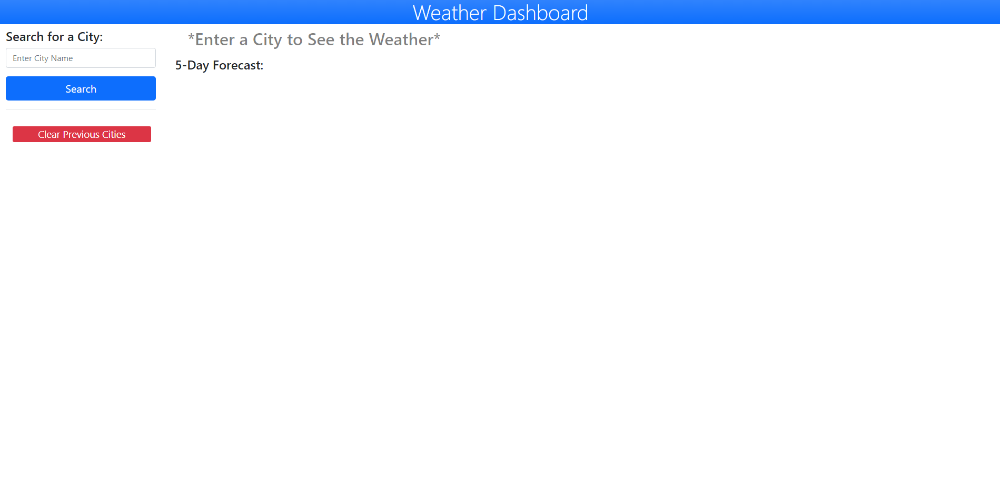
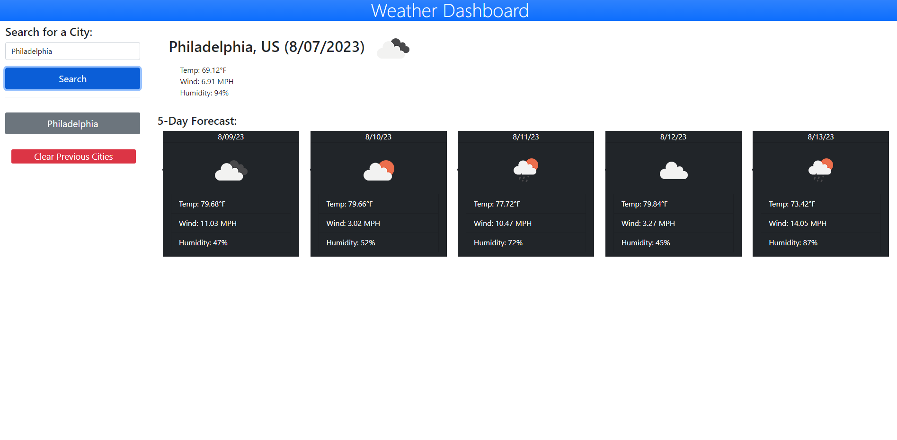
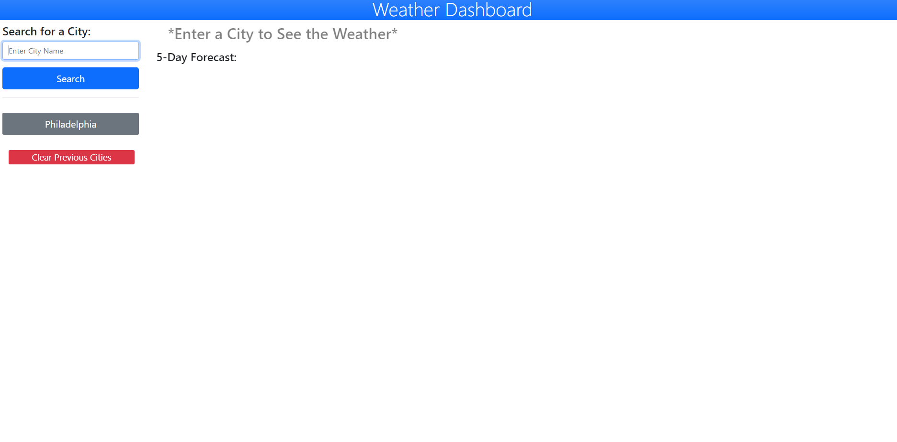

# Weather-Forecaster

## Description 
This a repository for an application that allows users to enter a city name that will give them the weather for that city and additionally, give the user a 5-day forecast of the city they searched. The application was created in order to provide users the ability to look up weather information for different cities using third-party-web APIs. As a software developer, I was able to test my use and understanding of third-party-apis. I was able to apply fetch methods within my javascript code to gather specific information from a third-party database and display the appropriate information on the webpage. Additionally, this application helped me practice the fundamentals of javascript.

## Usage
In order to use this application, first, you will need to go to the application landing page which can be found here, https://kevalpatel6.github.io/Weather-Forecaster/ On the landing page you can see an input field to the top-left of the page. 

Below you can see a screenshot of the landing page.

As a user, you will enter the name of a city and 'click' the search button below the input field. 

After clicking the search button the forecast for that city will be displayed for the current day. The weather information includes, temperature, wind, and humidity. Below the current day forecast, there will be a 5 day forecast as well with the same weather information for those days. 

Below you can see a screenshot of a search for the city of 'Philadelphia'

You may also see a 'grey' button get created for the previous searched city. This search will be saved in local storage and the data for that city can be accessed again by clicking on this button. 

Below you can see a screenshot of the previous search for 'Philadelphia'

Additionally, there is a 'red' button titled 'Clear Previous Cities' under all the previous searches. Clicking on this button will clear the previous search list and your local storage. 

Finally, if you enter a city that does not exist. Then you will see the title change to 'You must enter a valid city name'

Below is a screen shot of when this error occurs for a search for 'awefawf'

## Credits
Credit to my tutor Joem Casusi for helping me with the issues I was having with my code with regards to the fetch for the buttons, retrieving local storage data and displaying it to the page, and for help with bootstrap spacing.

## License
MIT License

Copyright (c) [2023] [Keval Patel]

Permission is hereby granted, free of charge, to any person obtaining a copy of this software and associated documentation files (the "Software"), to deal in the Software without restriction, including without limitation the rights to use, copy, modify, merge, publish, distribute, sublicense, and/or sell copies of the Software, and to permit persons to whom the Software is furnished to do so, subject to the following conditions:

The above copyright notice and this permission notice shall be included in all copies or substantial portions of the Software.

THE SOFTWARE IS PROVIDED "AS IS", WITHOUT WARRANTY OF ANY KIND, EXPRESS OR IMPLIED, INCLUDING BUT NOT LIMITED TO THE WARRANTIES OF MERCHANTABILITY, FITNESS FOR A PARTICULAR PURPOSE AND NONINFRINGEMENT. IN NO EVENT SHALL THE AUTHORS OR COPYRIGHT HOLDERS BE LIABLE FOR ANY CLAIM, DAMAGES OR OTHER LIABILITY, WHETHER IN AN ACTION OF CONTRACT, TORT OR OTHERWISE, ARISING FROM, OUT OF OR IN CONNECTION WITH THE SOFTWARE OR THE USE OR OTHER DEALINGS IN THE SOFTWARE.